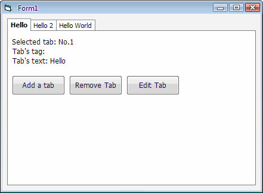



## Basic Tab Control

### Description

VB6 apps cannot easily access something called Tabs unless you either use the common control ocx (a dependency) or by using pages of API. This simple tab control is indeed a very simple control that has the core functionality of the common control tabs.
 
### More Info
 
You can use the command AddTab / AddTabs to add one or many tabs at the same time.

             |
---                |---
**Submitted On**   |2007-08-21 04:50:18
**By**             |[Brian Lai](https://github.com/Planet-Source-Code/PSCIndex/blob/master/ByAuthor/brian-lai.md)
**Level**          |Intermediate
**User Rating**    |4.3 (17 globes from 4 users)
**Compatibility**  |VB 6\.0
**Category**       |[Custom Controls/ Forms/  Menus](https://github.com/Planet-Source-Code/PSCIndex/blob/master/ByCategory/custom-controls-forms-menus__1-4.md)
**World**          |[Visual Basic](https://github.com/Planet-Source-Code/PSCIndex/blob/master/ByWorld/visual-basic.md)
**Archive File**   |[Basic\_Tab\_2080288212007\.zip](https://github.com/Planet-Source-Code/brian-lai-basic-tab-control__1-69192/archive/master.zip)

